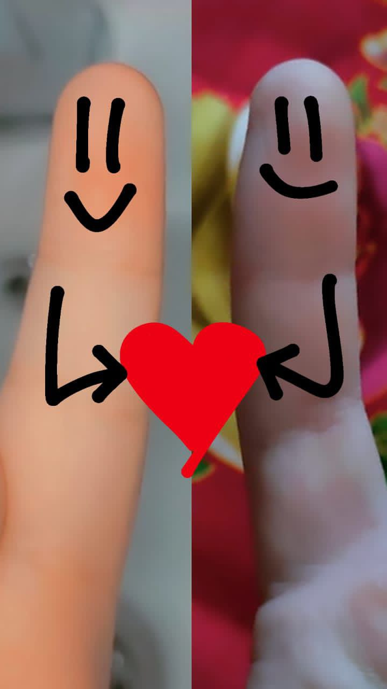

# my-love
My project on Git
<!DOCTYPE html>
<html>
<head>
  <title>My Confession</title>
  
</head>
<body>

  <h1>I Muhammadkhon confess my love to Jasmine</h1>
  
and want her to always be there even when I'm angry or trying to break up, you know? <3

   

</body>
</html>
